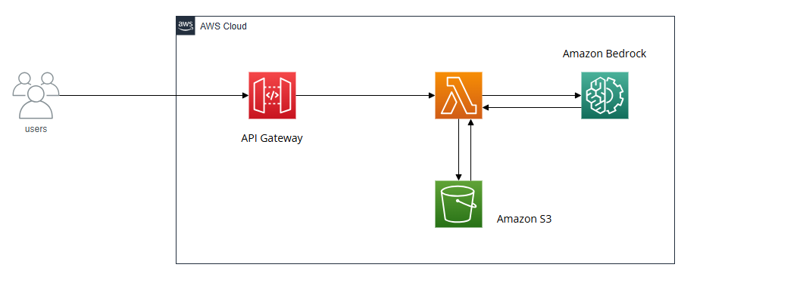
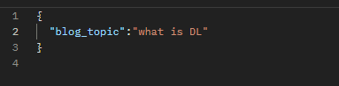
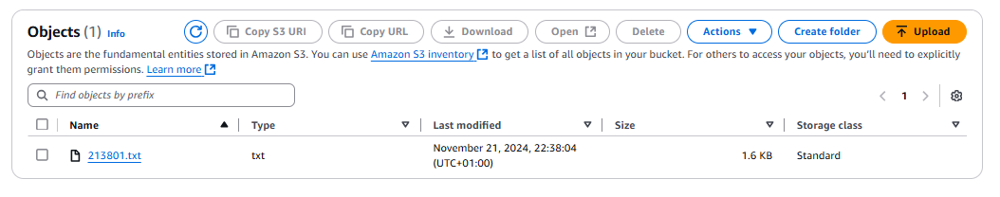

# Bedrock-S3-Lambda-App

## Overview

## This repository contains the source code and configurations for a serverless application integrating Amazon Bedrock, AWS Lambda, Amazon S3, and API Gateway. It is designed to handle user requests, leverage AI/ML capabilities through Bedrock, and manage data storage in S3.

## Architecture Diagram

### Description

- **Users**: Send HTTP requests via API Gateway.
- **API Gateway**: Acts as the entry point for the application, routing user requests to the AWS Lambda function.
- **AWS Lambda**: Processes the requests, interacts with Amazon Bedrock for AI/ML functionalities, and stores or retrieves data from Amazon S3 as required.
- **Amazon Bedrock**: Provides AI/ML model capabilities to enhance the application’s functionality.
- **Amazon S3**: Used for storing and retrieving data required by the application.

---

## Features

- **Serverless Design**: Fully managed architecture using AWS services for cost efficiency and scalability.
- **AI/ML Integration**: Leverages Amazon Bedrock for advanced AI capabilities.
- **Secure and Scalable**: Utilizes API Gateway and AWS Lambda to securely handle user requests at scale.
- **Data Storage**: Efficiently manages data with Amazon S3.

---

## Prerequisites

- AWS Account
- AWS CLI configured with proper credentials
- Postman (or similar API testing tool)
- Python runtime for Lambda functions

---

## Application Output Log

